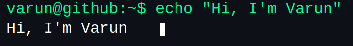

<table align="center"> <tr><td width="25%">  </td> <td width="25%">  </td>   </td> <td width="25%">  </td><td width="25%">  </tr> </table>

  

  

  

 About Me

<table> <tr> <td width="60%"> <ul> <li>🎓 <b>Thapar Institute of Engineering and Technology</b></li> <li>💻 <b>Full-Stack Developer</b> | MERN Stack | AI/ML Enthusiast</li> <li>🔭 Currently focusing on debugging</li> <li>🌱 Exploring <b>Deep Learning</b>, <b>3D Graphics</b>, and <b>Open Source</b></li> <li>⚡ Fun fact: <b>I love turning coffee into code and bugs into features</b></li> </ul> </td> <td width="40%">  </td> </tr> </table>

 Tech Stack & Tools

                     

 Featured Projects

 <table> <tr> <td width="50%"> <h3 align="center">💬 Comment Toxicity Detection</h3> 
  
<strong>Python · LSTM · NLP</strong>
 
Deep learning model detecting toxic comments using bidirectional LSTM. Achieves high accuracy in classifying harmful content.
 
 </td> <td width="50%"> <h3 align="center">💬 Chat App (MERN)</h3> 
  
<strong>MongoDB · Express · React · Node.js · Socket.IO</strong>
 
Real-time chat application with Cloudinary integration for media sharing and seamless communication.
 
 </td> </tr> <tr> <td width="50%"> <h3 align="center">♠️ Blackjack Game</h3> 
  
<strong>HTML · CSS · Python · SQLite</strong>
 
Interactive Blackjack game with real-time score updates and global leaderboard.
 
 </td> <td width="50%"> <h3 align="center">📝 BlogApp</h3> 
  
<strong>MERN · Redux · Material-UI</strong>
 
Full-stack blog platform with CRUD operations and global state management.
 
 </td> </tr> <tr> <td width="50%" colspan="2"> <h3 align="center">🎮 3D Tower Defense</h3> 
  
<strong>C++ · OpenGL · GLUT</strong>
 
3D tower defense game with multiple enemy types, tower upgrades, and resource management.
 
 </td> </tr> </table> 

 Connect With Me

     

 My Coding Vibe

 <table> <tr> <td></td> <td></td> <td></td> </tr> <tr> <td align="center"><b>Let's Catch!</b></td> <td align="center"><b>Cat & Mouse</b></td> <td align="center"><b>It's a Feature!</b></td> </tr> </table> 

  
<i>Ultra Fast typing energy ⚡</i>
 

 Random Dev Quote

  

    

  

 <h3>  Thanks for Visiting! </h3> 

  

